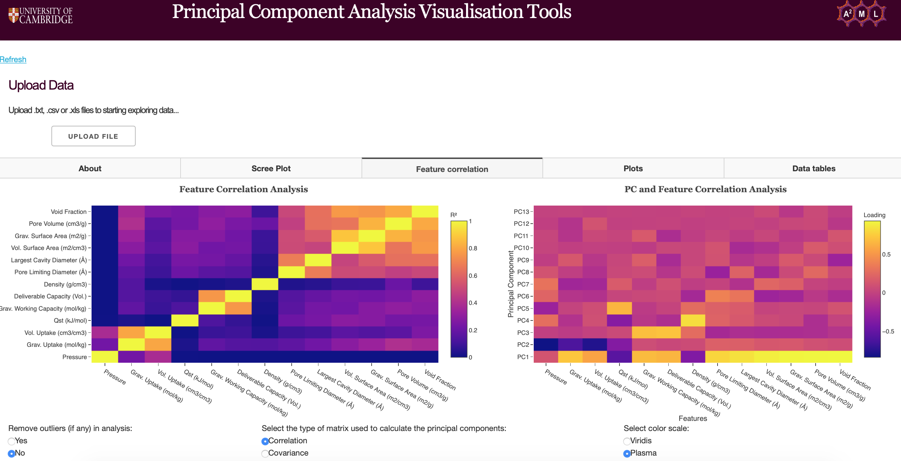

# Principal Component Analysis Visualisation Tools

## About
These tools aim to provide a reproducible and consistent data visualisation platform where experimental and computational researchers can perform Principal Component Analysis (PCA) to explore their data without requiring a line of code. PCA is a dimension reduction technique that can be used to reduce a large set of variables to a smaller set of orthogonal (uncorrelated) variables called principal components that still contains most of the datasets information. 
- PCA can be used to 1) ease data visualisation and 2) be used as a pre processing step before using another machine learning algorithm (regression or classification)


### App Manual
- The app manual, explaining data file upload requirements, features of the tool and how to read the plot outputs can be found [here](https://aaml-analytics.github.io/pca-explorer/)

## Deployment options
- Users can deploy using the push Heroku button or deploy the app using command line, to either a development or production server. Command line is recommended as app requests are quicker.

## Deploying to Heroku
```bash
heroku create
git push heroku master
heroku open
```
Alternatively, you can deploy your own copy of the app using this button and creating your own Heroku account:
[](https://heroku.com/deploy)

- Note: Once you have created your own copy of the app, after a period of inactivity Heroku shuts down the app's containers. Once the app gets a web request (the link above is used), it will wake up, but the initial response can take 10-20 seconds.

## Deploy app on server (production and development)

### Requirements
- Download [Python 3](https://www.python.org) if not already installed 
- Install [Git](https://git-scm.com/downloads) 
-- Installation instructions using command line can be found [here](https://git-scm.com/book/en/v2/Getting-Started-Installing-Git) 
Note: If you are using Git after upgrading to macOS Catalina and get the following error...
```bash
xcrun: error: invalid active developer path (/Library/Developer/CommandLineTools), missing xcrun at: /Library/Developer/CommandLineTools/usr/bin/xcrun
```
...run the following in your terminal:
```bash
xcode-select --install
```
- Install virtualenv to create virtual environments 
```bash
pip install virtualenv
```

### Running the app
To run this app first clone repository and then open a terminal to the app folder.
```bash
git clone https://github.com/aaml-analytics/pca-explorer/
cd pca-explorer
```

Create and activate a new virtual environment (recommended) by running the following:

On Windows:
```bash
virtualenv venv
\venv\scripts\activate
```

Or if using macOS or linux
```bash
python3 -m venv myvenv
source myvenv/bin/activate
```

Install the requirements:

```bash
pip install -r requirements.txt
```

#### Run the app on development server:
```bash
python app.py
```
You can then run the app on your browser at http://127.0.0.1:8050
- To quit the app press (CTRL +C). You will have to run the app again with this command everytime you leave your terminal/ quit the app.

#### Run the app on production server by Gunicorn:
The suggested number of workers is (2*CPU)+1. For a dual-core (2 CPU) machine, 5 is the suggested workers value. The number of workers should equal the number of threads. The user can either use the below or change the worker and threads number accordingly.
```bash
gunicorn app:server --workers=5 --threads=5 --bind 0.0.0.0:8000
```
You can then run the app on your browser at http://0.0.0.0:8000
- This URL will continue running and can be used to access the app even after you have left your terminal.

## Screenshots



## Contributing
When contributing to this repository, please first discuss the change you wish to make via issue, email, or any other method with the owners of this repository before making a change. You can also contact the AAML research group to discuss further contributions and collaborations. Please read [CONTRIBUTING.md](https://github.com/aaml-analytics/mof-explorer/blob/master/CONTRIBUTING.md) for details on our code of conduct.

## **Contact Us**
**Email**: 
[Mythili Sutharson](mailto:mls67@cam.ac.uk),
[Nakul Rampal](mailto:nr472@cam.ac.uk),
[Rocio Bueno Perez](mailto:rb901@cam.ac.uk),
[David Fairen Jimenez](mailto:df334@cam.ac.uk) <br>
**Website:** http://aam.ceb.cam.ac.uk/ <br>
**Address:** <br>
Department of Chemical Engineering and Biotechnology <br>
Cambridge University <br>
Philippa Fawcett Dr<br>
Cambridge <br>
CB3 0AS

## License
This project is licensed under the MIT License - see the [LICENSE.md](https://github.com/aaml-analytics/pca-explorer/blob/master/LICENSE) file for details

## Acknowledgments
<p> 
  
</p>

- [AAML Research Group](http://aam.ceb.cam.ac.uk) for developing this dashboard for the MOF community. Click [here](http://aam.ceb.cam.ac.uk/research.html) to read more about our work
- [Dash](https://plot.ly/dash/) - the python framework used to build this web application

